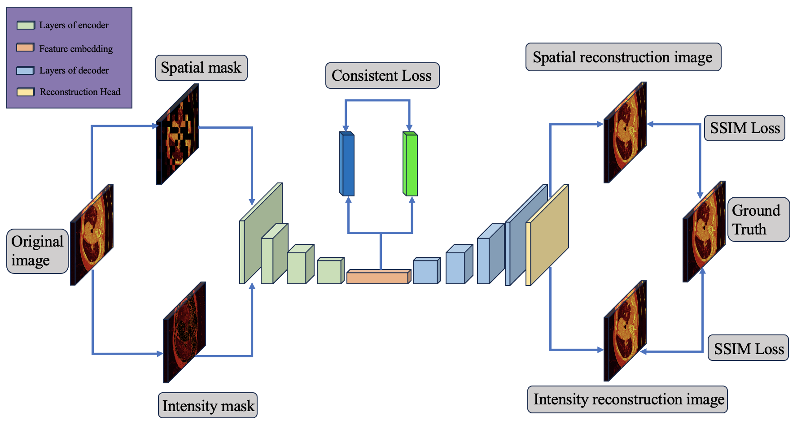

# 1.Overview
This is a brief guide on the pre-training of the ISD-MAE model. The paper is available at https://arxiv.org/abs/2411.13198.

The implementation of this model is located in the models folder, mainly in the file [unet_ae.py](./models/unet_ae.py).In the [config.py](./cfgs/config.py) file, a series of hyperparameters are defined, including batch size, input image size, mask ratio, learning rate, training epochs, and so on.

# 2.Datasets
The pre-trained dataset can be downloaded from [here](https://pan.baidu.com/s/1Zw4HHBo-N-0dlDdP_feVLQ?pwd=sef7). After downloading the dataset to your local machine, you can run the code by setting the path in [config.py](./cfgs/config.py).
# 3.Usage
After properly setting the dataset, you could easily train the model with the following command:
```
python train_unet_ae.py
```
You may need to set some hyperparameters in [config.py](./cfgs/config.py).